# How to Add Environment Variables in IntelliJ IDEA
## Step-by-Step Guide with Screenshots

Environment variables allow you to pass configuration settings to an application without hard‑coding them in the source code. This is convenient for storing API keys, database connection parameters, and other sensitive or changeable data. In this guide you will learn how to set environment variables for a specific run configuration in IntelliJ IDEA.

---

### Step 1. Open the Project
Launch IntelliJ IDEA and open the project in which you need to configure environment variables.

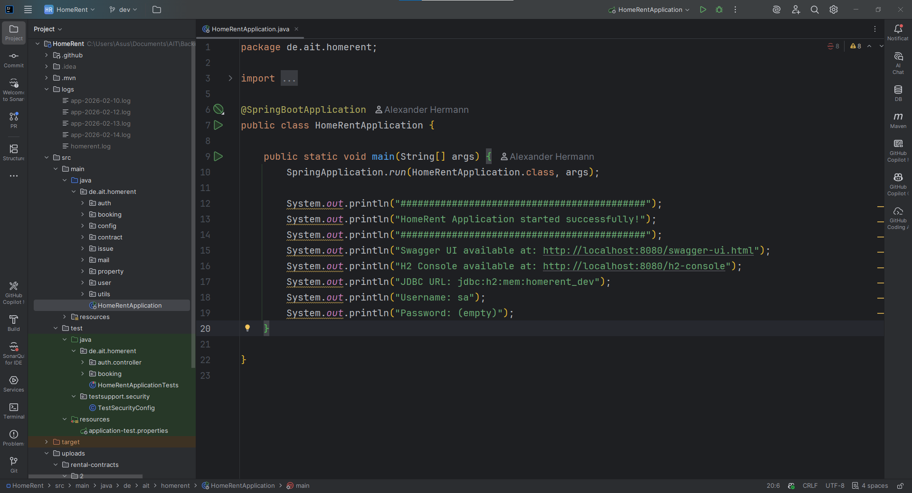

You are in the run configuration dialog for `HomeRentApplication` and want to add environment variables. Below is the sequence of actions that continues your process.

---

### 1. Open the Configuration Edit Window
You are already at the step where the **Run/Debug Configurations** window is visible (screenshots [4](./screenshots/environment/Screenshot_4.png) and [5](./screenshots/environment/Screenshot_5.png)). If not – click the configuration drop‑down list (the green triangle) and select **Edit Configurations…**.

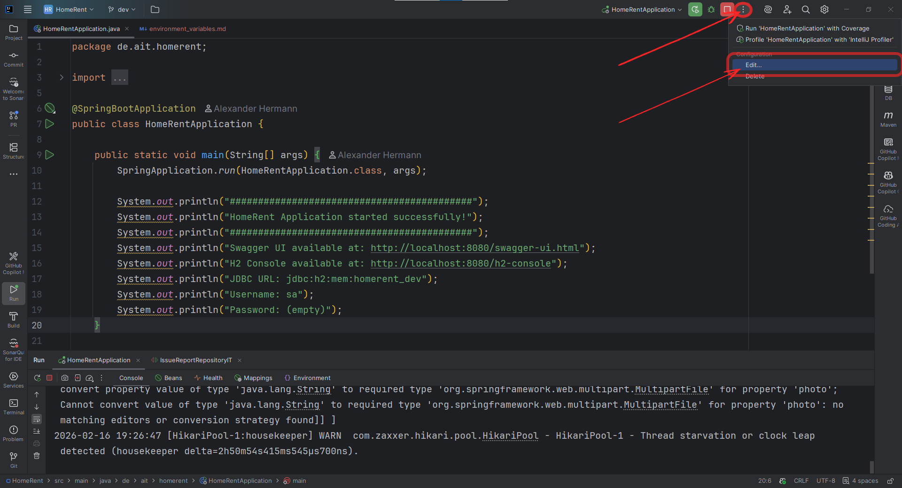

or via the menu: `Run` → `Edit Configurations…`.

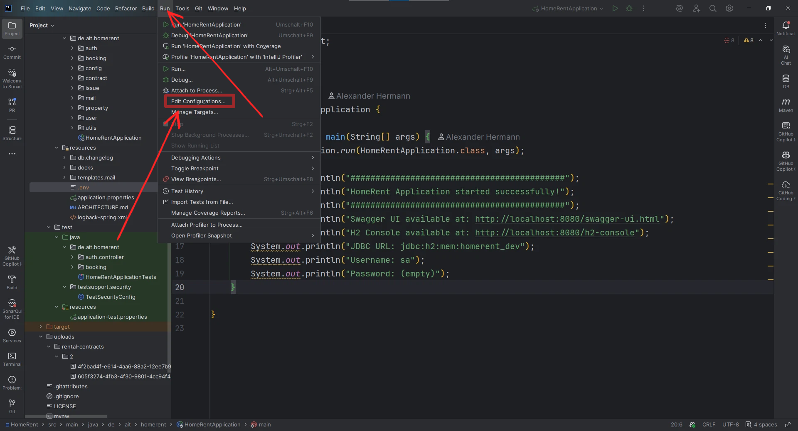

Now you see the list of configurations on the left and the settings of the selected configuration on the right.

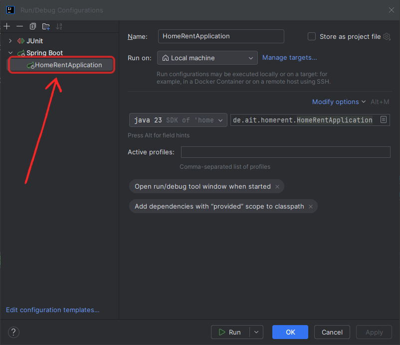

Then, on the right side, locate the section related to environment variables. In different configuration types it may be named differently, but usually it is something like **Environment** or **Environment variables**. If you do not see a field for environment variables, you may need to scroll down or expand additional settings.

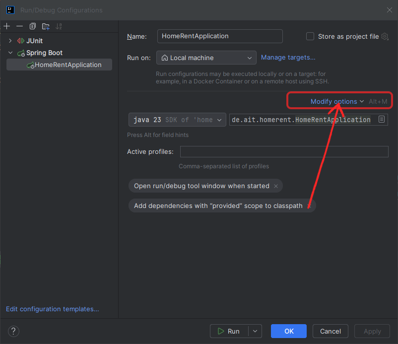

### 2. Activate the “Environment variables” Option
Screenshot 6 shows the **Modify options** menu (the button in the top‑right corner).

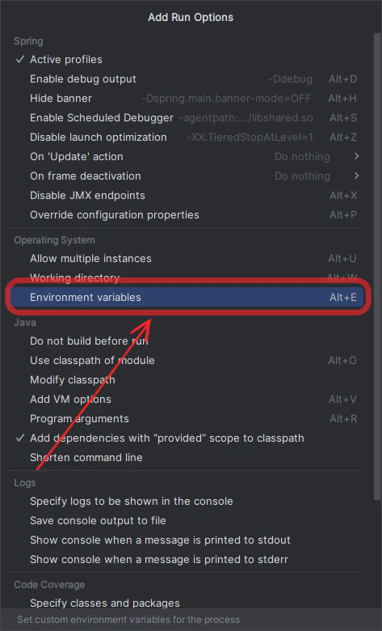

Click it, and in the **Operating System** section, check **Environment variables** (shortcut Alt+E).

After that, the **Environment variables** field will appear in the configuration window.
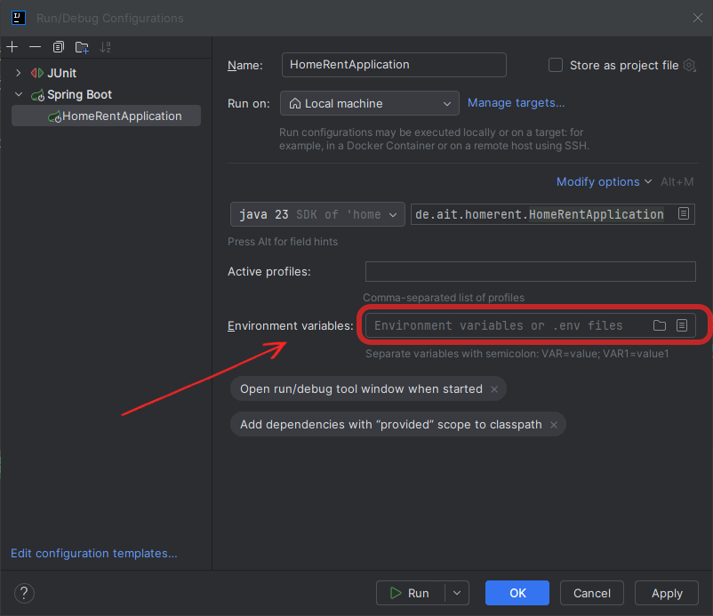

### 3. Set the Environment Variables
You have two options:

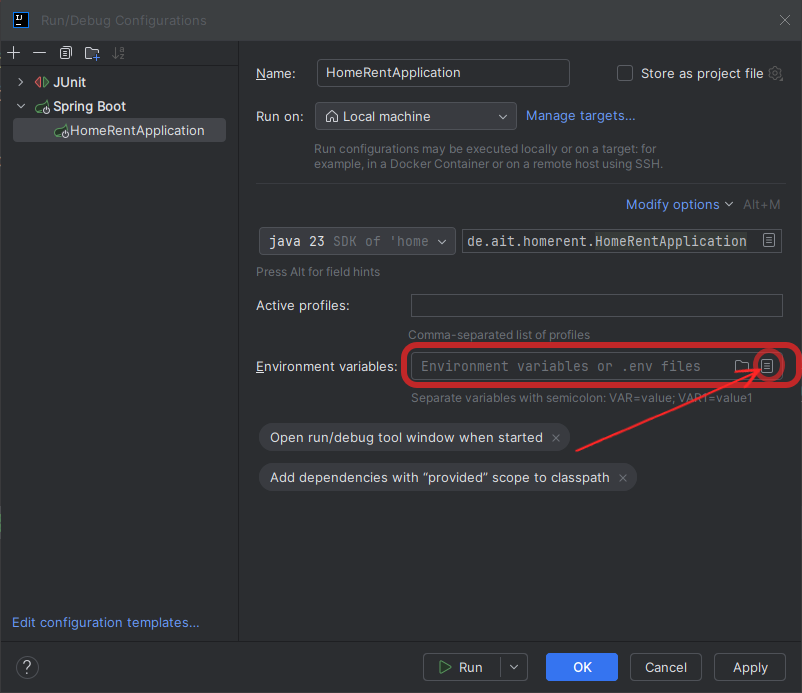

#### Option A — Enter Values Manually
In the **Environment variables** field, write the variables in the format:  
`NAME1=value1;NAME2=value2`  
Example from screenshot 2:  
`EMAIL_FROM_USERNAME=email@example.com`

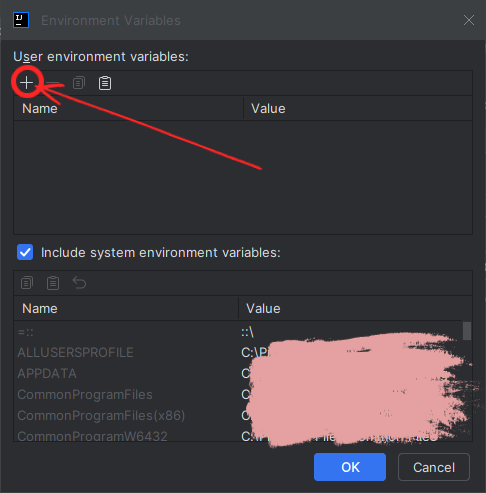

#### Option B — Use a `.env` File
If you want to load variables from a file (e.g., `.env`) located in the `resources` folder:
1. Click the folder selection button.

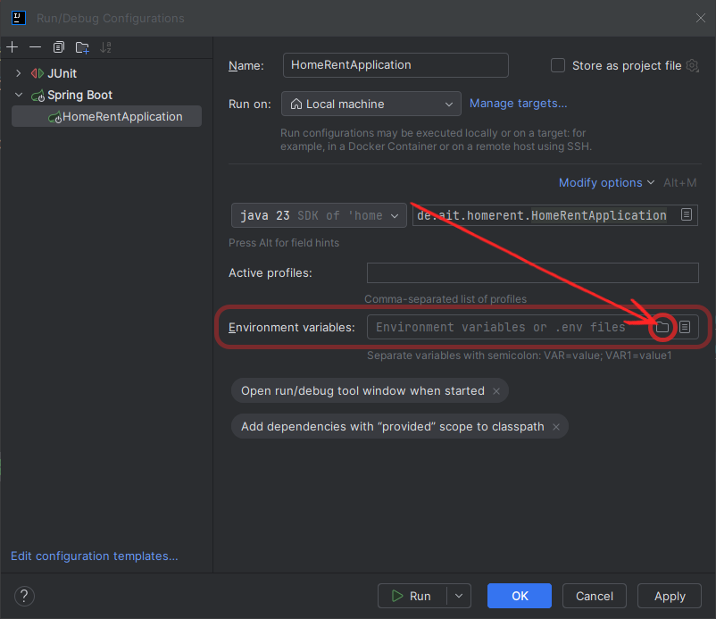

2. The **Environment Files and Scripts** window opens. It is empty for now.
3. Click **+** (the green plus) and choose **.env file** from the file system.

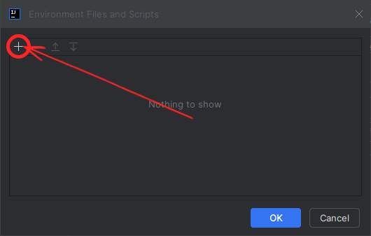

4. In the file selection dialog that appears, find and select the `.env` file located in `src/main/resources/`.
   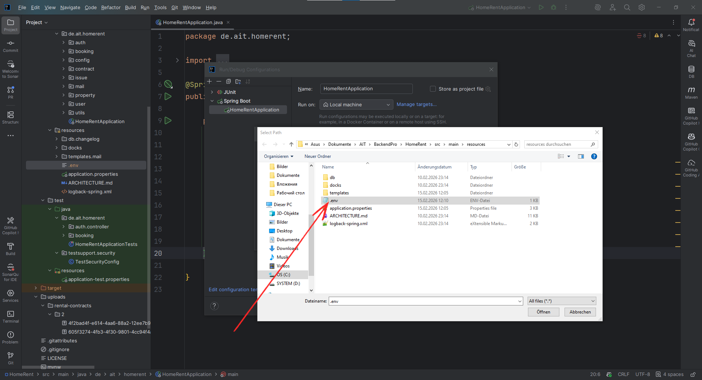

5. After selection, the file appears in the list. Click **OK**.

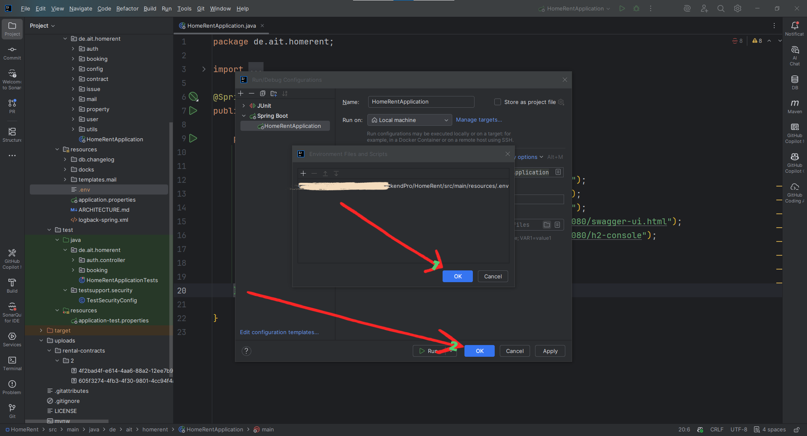

### 4. Save the Configuration
Back in the main window, click **OK** or **Apply** (screenshots 4, 5, 7 – buttons at the bottom).

### 5. Run the Application
Now, when you run the application using this configuration, the variables from `.env` (or manually specified) will be available in the application. You can verify this by, for example, adding `System.getenv("EMAIL_FROM_USERNAME")` in your code.

---

## Important Notes
- The format of the `.env` file is one variable per line:  
  `EMAIL_FROM_USERNAME=email@example.com`  
  `DB_PASSWORD=secret`

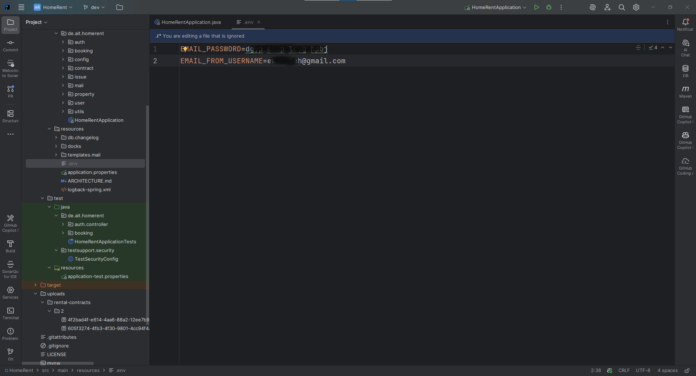

- Variables set directly in the field take precedence over those from the file if both are specified.
- Remember that the `.env` file should not be committed to version control (add it to `.gitignore`) if it contains secrets.

If you have any further questions or need help with specific values – feel free to ask!